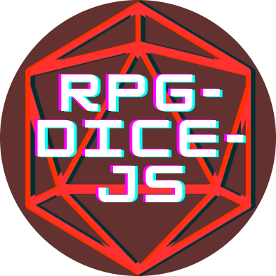
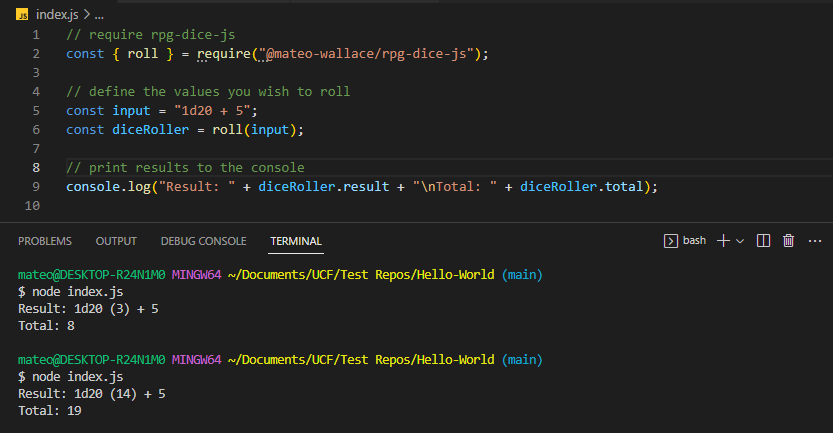

# :icon-home: Welcome to the rpg-dice-js Docs

<!-- SHIELDS -->

[](https://www.npmjs.com/package/@mateo-wallace/rpg-dice-js) [](https://github.com/Mateo-Wallace/rpg-dice-js/stargazers) [](https://github.com/Mateo-Wallace/rpg-dice-js/network/members) [](https://github.com/Mateo-Wallace/rpg-dice-js/graphs/contributors) [](https://github.com/Mateo-Wallace/rpg-dice-js/blob/main/LICENSE) [](https://www.linkedin.com/in/mateo-wallace/)

<!-- PROJECT LOGO & HEADER -->
<br />
<div align="center">


  <h1 align="center"><strong>rpg-dice-js</strong></h1>

  <p align="center">
    <strong>A dice roller for the modern JavaScript developer</strong>
    <br />
    With many settings options and response types for full customization
    <br />
    <br />
    <a href="https://mateo-wallace.github.io/rpg-dice-js/">View Docs</a>
    ·
    <a href="https://github.com/Mateo-Wallace/rpg-dice-js">View GitHub</a>
    ·
    <a href="https://www.npmjs.com/package/@mateo-wallace/rpg-dice-js">View npm</a>
    ·
    <a href="https://github.com/Mateo-Wallace/rpg-dice-js/issues">Report Bug</a>
  </p>
</div>

```
npm i @mateo-wallace/rpg-dice-js
```

<!-- ABOUT THE PROJECT -->

## About The Project



rpg-dice-js is an npm package that allows a user to send an input to a `roll()` function with no need to make random number logic. It was specifically built to comply with the dice of games such as **Dungeons and Dragons** or **Pathfinder**.

Main Features:

- [Settings](https://mateo-wallace.github.io/rpg-dice-js/diceclass/#settings) adjustment within a `Dice` model
- [User input](https://mateo-wallace.github.io/rpg-dice-js/rollfunction/#valid-inputs) of all kinds accepted
- [Dice response object](https://mateo-wallace.github.io/rpg-dice-js/rollfunction/#output) with robust information such as `input`, `result`, `total`, etc...

See the [Quick Start](https://mateo-wallace.github.io/rpg-dice-js/quickstart/) guide to see how to implement rpg-dice-js into your code!

### Built With

[](https://developer.mozilla.org/en-US/docs/Web/JavaScript) [](https://www.npmjs.com/) [](https://nodejs.org/en/)
